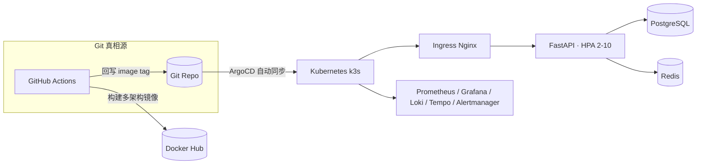

# CloudForge

一个在本地 k3s 集群上跑通的云原生部署与可观测性项目：FastAPI 应用从 GitHub Actions
构建多架构镜像开始，经 ArgoCD GitOps 自动同步到 Kubernetes，再接入 Prometheus、Grafana、
Loki、Tempo 与 Alertmanager 完成可观测闭环。所有能力都在真实集群上压测验证过，数据见下。


[](https://github.com/Rain-edge/CloudForge/actions)


## 做什么

围绕一条完整的部署链路验证云原生运维的核心机制：

- **GitOps 闭环**：`git push` 触发 GitHub Actions 构建 amd64/arm64 镜像并推送 Docker Hub，
  新镜像 tag 自动写回 Helm values → ArgoCD 检测变更自动同步到集群。回滚 = 回退代码重新 push。
- **可观测性三支柱**：应用以 JSON 结构化日志输出（携带 `trace_id`/`span_id`/`request_id`），
  Prometheus 采集指标、Loki 收集日志、Tempo 存储链路，Grafana 里点击日志中的 trace_id
  即可跳转完整调用链。
- **K8s 原生韧性**：HPA（2-10 副本）在压测下自动扩容；Liveness/Readiness 分离探针 +
  PDB 保障故障自愈；金丝雀发布按 nginx 权重灰度放量，异常时秒级摘流回滚。
- **生产向的工程细节**：多阶段构建出 174MB 非 root 镜像（较单阶段 487MB 瘦身 64%）；
  Redis 缓存带降级（不可达自动直读 DB）；21 个 pytest 用例随 CI 执行。

## 架构



## 快速开始

```bash
# 一键创建 k3d 集群 + 安装可观测性栈（脚本内含国内镜像预拉，不卡 ghcr.io）
bash scripts/setup-k3d.sh
bash scripts/preload-images.sh && bash scripts/setup-observability.sh

# 构建镜像 → 导入集群 → Helm 部署（含 PostgreSQL + Redis）
docker build -f docker/Dockerfile -t cloudforge--app:latest .
k3d image import cloudforge--app:latest -c cloudforge
helm install cloudforge ./chart

# 验证
kubectl port-forward svc/cloudforge 8000:8000
curl http://localhost:8000/health   # {"status":"ok","db":"connected"}
```

完整部署与排障记录在 [docs/RUNBOOK.md](docs/RUNBOOK.md)，GitOps 接入见
[argocd/cloudforge-app.yaml](argocd/cloudforge-app.yaml)。

## 实测数据

以下结果来自本地 k3s 集群（Windows + WSL2 + k3d，1 server + 2 agents）的真实实验，
完整时间线与原始记录在 [docs/experiments](docs/experiments)：

| 验证项 | 结果 |
|--------|------|
| k6 压测（50 VU / 90s） | 错误率 0%，峰值 28 RPS |
| HPA 扩缩容 | CPU 打至 152%/70% → 副本自动 2→3→5→6，压测结束冷却缩回 2，全程零干预 |
| 金丝雀灰度 | weight 10/50/100 实测分流 10%/48%/100%，逐请求计数 |
| 异常回滚 | weight=0 秒级摘流（≤2s），回滚期间 63 个请求零失败 |
| 告警链路 | 推送测试告警 → Alertmanager → webhook → 应用日志落 `alertmanager_webhook_received`（含 trace_id） |

> 压测 p95 为 1.57s（阈值 500ms 未达标）——逐层定位为 WSL2/k3d overlay 网络并发开销 +
> SQLAlchemy async 层 + 单 worker 饱和，属本机环境基线而非代码缺陷；完整分析见 RUNBOOK。

## License

MIT
